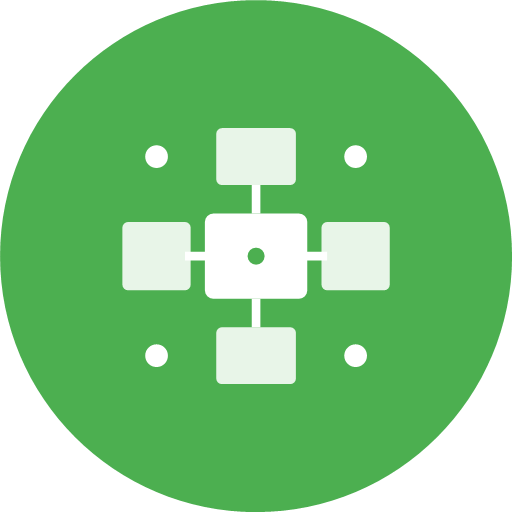

<div align="center">
</br>


</div>

<div align="center">

# **Maxitendo Commons**

</div>

</br>

<p align="center">
  </a>
  </a>
  </a>
  </br>
</p>

<p align="center">
 
 <a href="https://jitpack.io/#Maxitendo1/Maxitendo-Commons">
  

</br>

<br>
<br>

</a>

<div align="center">

# 🗺️ Project Overview

Maxitendo Commons is a comprehensive Android library providing common functionality for Special Contacts, including UI components, utilities, and shared resources. Originally forked from Goodwy Commons, it has been specifically adapted and enhanced for Maxitendo applications with modern Android development practices.


# ✨ Features

</div>

## **Core Components**
- **BaseSimpleActivity**: Foundation activity class with common functionality
- **AboutActivity**: Standardized about screen with app information
- **SettingsActivity**: Common settings interface
- **PrivacyPolicyActivity**: Privacy policy display
- **FAQActivity**: Frequently asked questions interface
- **CustomizationActivity**: App theming and customization

## **UI Components**
- **Compose Screens**: Modern Jetpack Compose UI components
- **Alert Dialogs**: Reusable dialog components (IconListDialog, RadioGroupDialog, etc.)
- **Theme System**: Consistent Material You theming across apps
- **Icon Customization**: App icon selection and customization (24 icons supported)
- **FastScroller**: Integrated fast scrolling components for lists
- **SwipeActionView**: Swipe-to-action functionality for list items
- **GestureViews**: Advanced gesture handling for images and content

## **Utilities & Extensions**
- **Kotlin Extensions**: Comprehensive extensions for common operations
- **Helper Classes**: Utility classes for various tasks (Config, Constants, etc.)
- **Database Components**: Room database setup and utilities
- **Permission Handling**: Streamlined permission request utilities
- **File Operations**: File management and I/O utilities
- **Image Processing**: Image manipulation and optimization tools

## **Integrated Libraries**
- **IndicatorFastScroll**: Fast scrolling with visual indicators
- **RecyclerView-FastScroller**: Enhanced RecyclerView scrolling
- **SwipeActionView**: Swipe gesture actions for list items
- **GestureViews**: Advanced image and content gesture handling

## **Special Features**
- **App-Specific Handling**: Custom behavior for different Maxitendo apps
- **GitHub Integration**: Direct links to appropriate repositories
- **Privacy Policy Integration**: Launch activities instead of web browsers
- **JitPack Distribution**: Easy integration via JitPack repository
- **FOSS Compliance**: Fully open source and libre components

<div align="center">

# 💻 Integration

</div>

## **Gradle Dependency**

### Add JitPack Repository

Add to your project's `settings.gradle.kts`:

```kotlin
dependencyResolutionManagement {
    repositoriesMode.set(RepositoriesMode.FAIL_ON_PROJECT_REPOS)
    repositories {
        google()
        mavenCentral()
        maven { setUrl("https://jitpack.io") }
    }
}
```

### Add Dependencies

Add to your app's `build.gradle.kts`:

```kotlin
dependencies {
    // Maxitendo Commons (All UI libraries integrated locally)
    implementation("com.github.Maxitendo1.Maxitendo-Commons:commons:d8bb080")
    implementation("com.github.Maxitendo1.Maxitendo-Commons:strings:d8bb080")
}
```

### Version Catalog (Recommended)

Add to your `gradle/libs.versions.toml`:

```toml
[versions]
maxitendo-commons = "d8bb080"

[libraries]
maxitendo-commons = { module = "com.github.Maxitendo1.Maxitendo-Commons:commons", version.ref = "maxitendo-commons" }
maxitendo-strings = { module = "com.github.Maxitendo1.Maxitendo-Commons:strings", version.ref = "maxitendo-commons" }
```

Then in your `build.gradle.kts`:

```kotlin
dependencies {
    implementation(libs.maxitendo.commons)
    implementation(libs.maxitendo.strings)
}
```

## **Basic Usage**

### Activity Integration

```kotlin
class MainActivity : BaseSimpleActivity() {
    override fun onCreate(savedInstanceState: Bundle?) {
        super.onCreate(savedInstanceState)
        // Your activity code
    }

    override fun getAppIconIDs() = arrayListOf(
        R.mipmap.ic_launcher,
        R.mipmap.ic_launcher_one,
        // ... more icons
    )

    override fun getAppLauncherName() = "Your App Name"
}
```

### About Screen Integration

```kotlin
// Launch About screen
startAboutActivity(
    appName = "Your App Name",
    appVersion = BuildConfig.VERSION_NAME,
    faqItems = faqList,
    repositoryName = "Your-Repository-Name"
)
```

### Icon Customization

```kotlin
// Show icon selection dialog
IconListDialog(
    activity = this,
    items = getAppIconIDs(),
    checkedItemId = currentIconId + 1,
    titleId = R.string.app_icon_color
) { wasPositivePressed, newValue ->
    if (wasPositivePressed) {
        // Handle icon selection
        updateAppIcon(newValue - 1)
    }
}
```

<div align="center">

# 📚 Tech Stack & Requirements

</div>

## **Requirements**
- **Minimum SDK**: Android API 21+
- **Kotlin**: 2.1.0+
- **Android Gradle Plugin**: 8.5.2+
- **Jetpack Compose**: Latest stable
- **Material Design 3**: Full support

## **Dependencies**
- **AndroidX Libraries**: Core, AppCompat, Lifecycle, Room
- **Jetpack Compose**: UI toolkit with Material 3
- **Kotlin Coroutines**: Asynchronous programming
- **Material Components**: Material Design components
- **Glide**: Image loading and caching
- **Room Database**: Local data persistence
- **Biometric**: Fingerprint and face authentication

</div>

<div align="center">

# 🌟 Contributing

</div>

We welcome contributions to Maxitendo Commons! Here's how you can help:

## **Getting Started**
1. Fork the repository
2. Create your feature branch (`git checkout -b feature/amazing-feature`)
3. Commit your changes (`git commit -m 'Add amazing feature'`)
4. Push to the branch (`git push origin feature/amazing-feature`)
5. Open a Pull Request

## **Development Setup**
```bash
git clone https://github.com/Maxitendo1/Maxitendo-Commons.git
cd Maxitendo-Commons
./gradlew commons:build
```

## **Reporting Issues**
- Use the GitHub issue tracker
- Provide detailed information about the bug or feature request
- Include steps to reproduce the issue (if applicable)

<div align="center">

# 👏 Credits

</div>

[Goodwy Commons](https://github.com/Goodwy/Goodwy-Commons)
</div>

<div align="center">

# ⚖️ License

```xml
Licensed under the GNU General Public License, Version 3.0 (the "License");
you may not use this file except in compliance with the License.
You may obtain a copy of the License at

https://www.gnu.org/licenses/gpl-3.0.en.html

This program is distributed in the hope that it will be useful,
but WITHOUT ANY WARRANTY; without even the implied warranty of
MERCHANTABILITY or FITNESS FOR A PARTICULAR PURPOSE. See the
License for the specific language governing permissions and
limitations under the License.
```

</div>